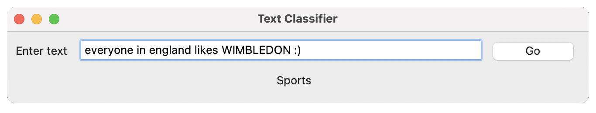

# 7071.2

# Text Classifier Application using Machine Learning

This repository contains a Jupyter Notebook and a dataset folder used in it. I created a desktop app where a user enters some text and the system shows if the input is either "Sports", "Science", or "Business" category (whichever more appropriate).

I created a Multinomial Naive Bayes model as this algorithm is suitable for text classification problem in Natural Language Processing.

# License
MIT License.

# Contact
If you have any questions or feedback, feel free to reach out.

### *** Please note that there is no <i>train.csv</i> inside the AG_News_Archive directory. I can't upload the file as it is more than 25 GB. Click the database link on notebook to download the dataset. ***
